# FN 11x11 Turbo Build Order

## Start

- **Build a Mill**, a **house**, followed by **2 farms**
- Begin clearing out room for a lumber mill

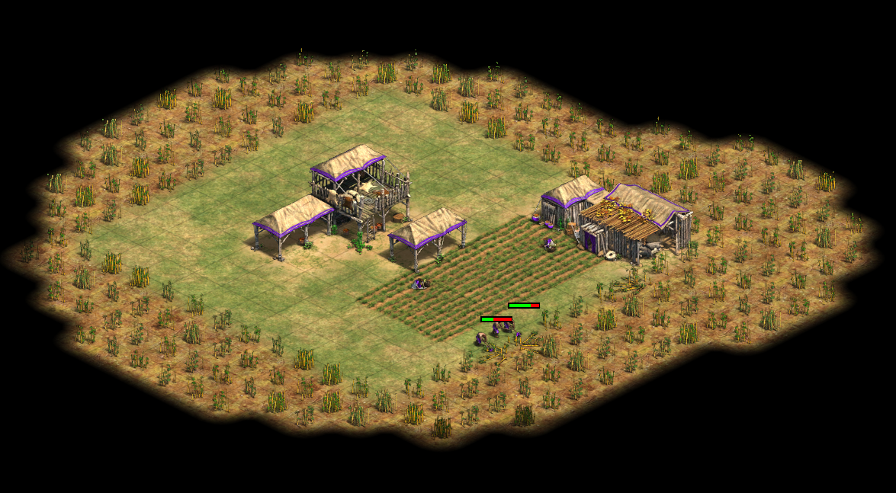

- **Build a lumber** mill in the space

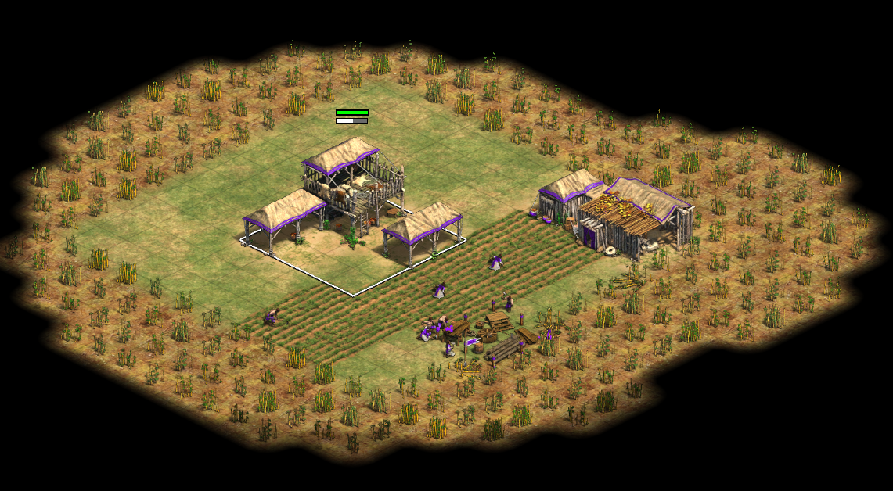

- **Build a house** top left
- Begin clearing space for additional house and farm

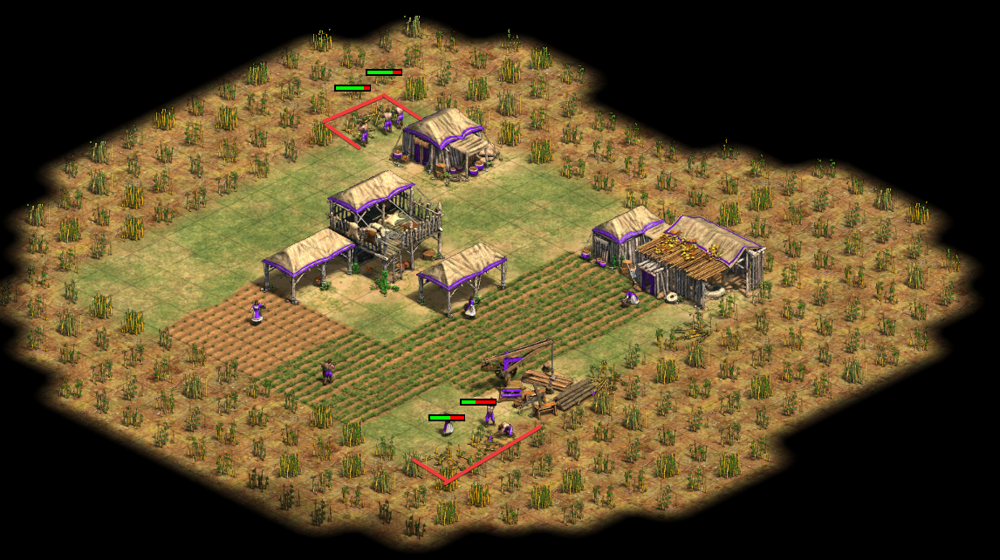

- **Build additional farms** and **third house**
- Continue clearing space for Houses\TC

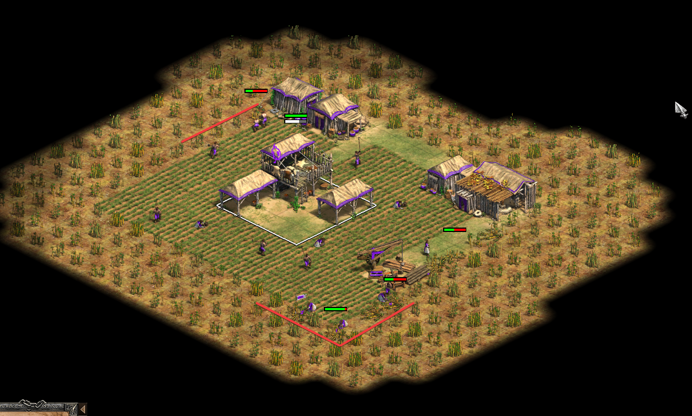

- Click up!

## Feudal Age

Arrive in feudal ~17 pop

- **Build a Market** to get Gold for castle
- **Build Blacksmith** and delete. Replace with **Farm**
- Click up!

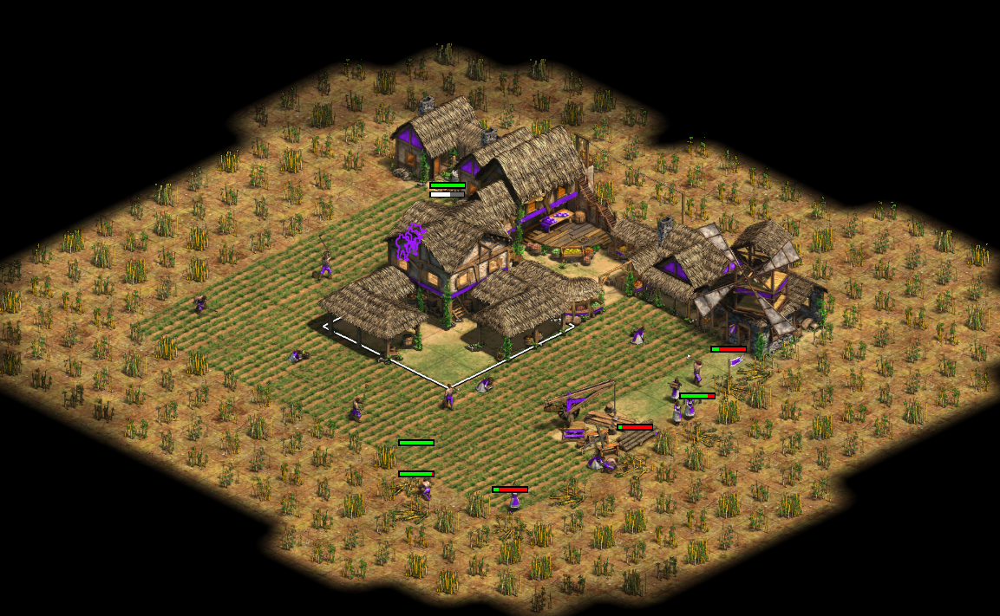

## Castle Age

Arrive in Castle with ~20 vils

- **Build 2 TCs**
- **Research Wheelbarrow**
- **Research Lumber upgrades**

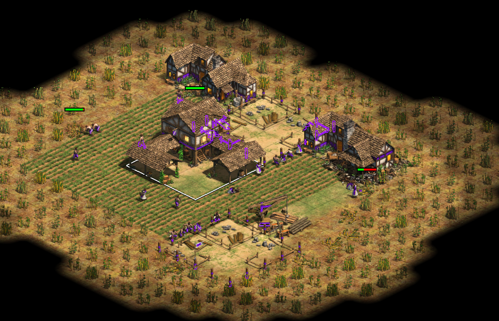

- Focus on these areas

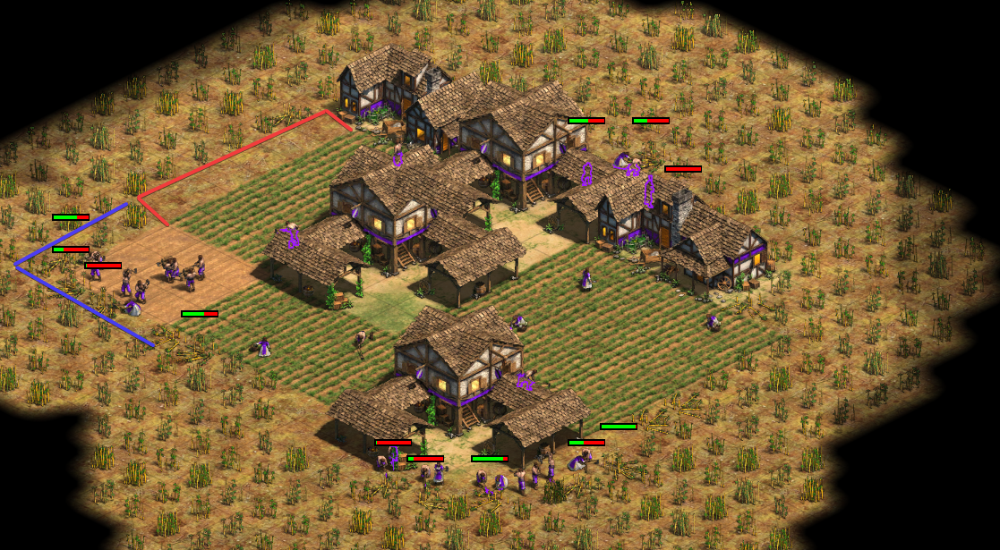

- **Build additional houses**

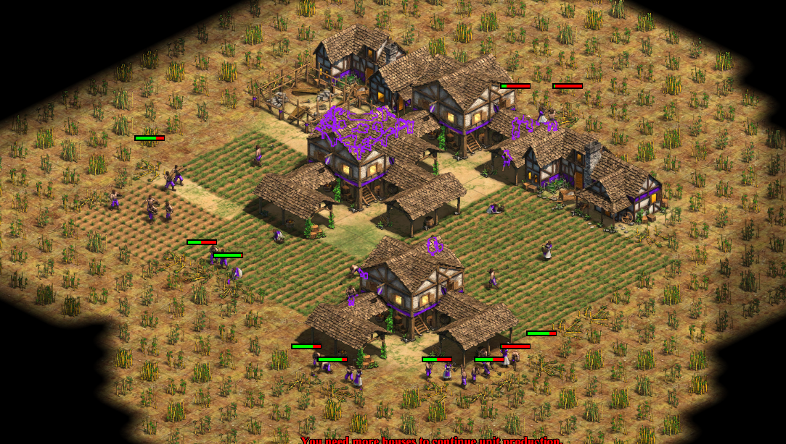

- And some **more houses and farms**

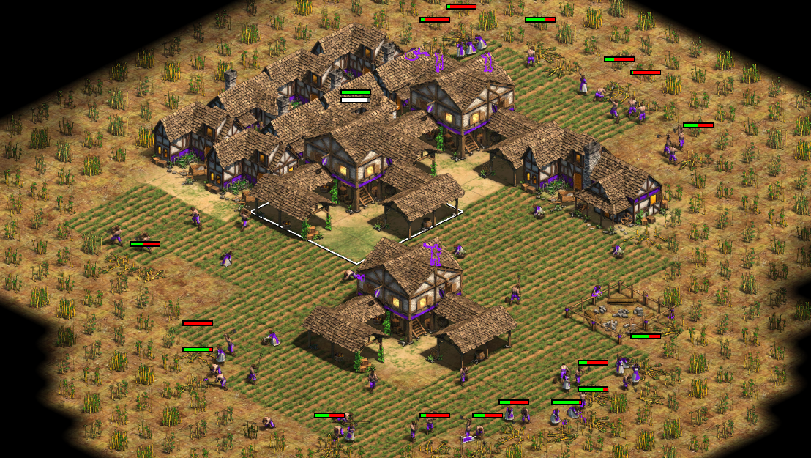

### Around 50 - 60 pop

- **Build Market** left to get Gold
- **Handcart upgrade**
- Delete Market and replace with **Workshop**
- Queue Mangos
- Build a **Monastery**
- Click Up!

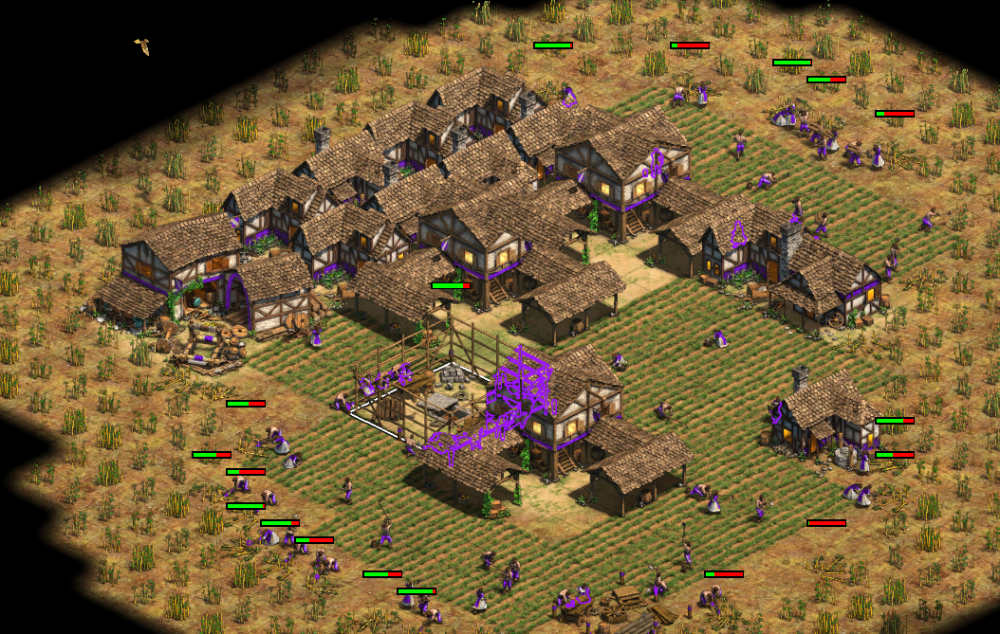

## Imperial Age

- **Research**:
  - Onager
  - Guilds
  - Loom
  - Townwatch
  - Bow Saw
- Start expanding

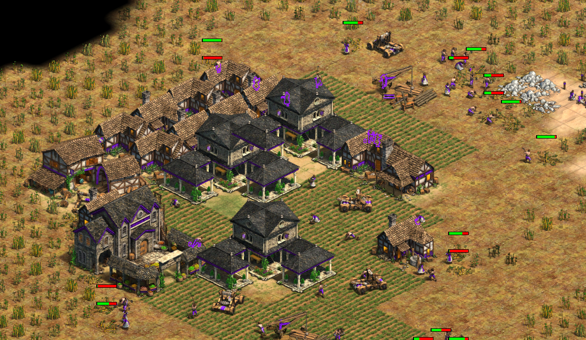

- More TCs, more farms
- Military Upgrades
- Build Castle
- Conscription
- Build Siege & Upgrade
- Get to 400 pop
- Balance eco distribution, ~250 vils
